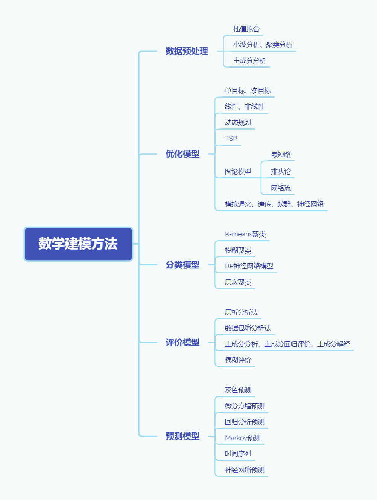

# 数学建模方法



## 层次分析法

摘自[知乎网友](https://zhuanlan.zhihu.com/p/38207837)，b站[教学视频](https://www.bilibili.com/video/BV1KE411q7Wh)参考。
- 层次分析法，简称AHP，是指将与决策总是有关的元素分解成目标、准则、方案等层次，在此基础之上进行定性和定量分析的决策方法。
- 对于求解不同的放案进行权值打分问题
  
#### 基本步骤：
##### 3.1 建立层次结构模型
将决策的目标、考虑的因素(决策准则)和决策对象按他们之间的相互关系分成最高层、中间层和最低层，绘制层次结构图。

1. 最高层(目标层)：决策的目的、要解决的问题；
2. 中间层(准则层或指标层)：考虑的因素、决策的准则；
3. 最低层(方案层)：决策时的备选方案；


##### 3.2构造判断(成对比较)矩阵
那在确定各层次各因素之间的权重时，如果只是定性的结果(就是我认为景色占80%，费用10%等等)，则常常不容易被别人接受，因此Santy等人提出：一致矩阵法，即：

1. 不把所有因素放在一起比较，而是两两比较；
2. 对此时采用相对尺度，以尽可能减少性质不同的诸因素相互比较的困难，以提高准去性；

成对比较矩阵是表示本层所有因素针对上一层某一个因素(准侧或目标)的相对重要性的比较。成对比较矩阵的元素 [公式] 表示的是第 [公式] 个因素相对于第 [公式] 个因素的比较结果，这个值使用的是Santy的1-9标度方法给出。


那比如，举上面的旅游的例子，在旅游问题中第二层A的各个因素对目标层Z的影响两两比较的结果如下图：


>以上判断矩阵的给出由专家打分和查阅网上资料可以得到，而在实际操作中，多采用自己打分的形式[doge]

##### 3.3层次单排序及一致性检验
##### 3.4层次总排序及其一致性检验
由于以上两步操作可直接由代码得到，因此不在这里详细叙述。


下面贴出层次分析法的权重求解Matlab代码，此代码只需要输入判断矩阵即可得出相应的权重值，其中包含一次性检验，如一次性检验不通过，不会输出权重值。
```  matlab
clc;
clear;
disp('请输入判断矩阵A');     %111111111
A=input('A=');
[m,n]=size(A);                     %获取指标个数
RI=[0 0 0.58 0.90 1.12 1.24 1.32 1.41 1.45 1.49 1.51];
R=rank(A);                         %求判断矩阵的秩
[V,D]=eig(A);                      %求判断矩阵的特征值和特征向量，V特征值，D特征向量；
tz=max(D);
B=max(tz);                         %最大特征值
B
[row, col]=find(D==B);             %最大特征值所在位置
C=V(:,col);                        %对应特征向量
CI=(B-n)/(n-1);                    %计算一致性检验指标CI
CR=CI/RI(1,n);
if CR<0.10
    disp('CI=');disp(CI);
    disp('CR=');disp(CR);
    disp('对比矩阵A通过一致性检验，各向量权重向量W为：');
    W=zeros(n,1);
    for i=1:n
        W(i,1)=C(i,1)/sum(C(:,1)); %特征向量标准化
    end
    W                              %输出权重向量
else
    disp('对比矩阵A未通过一致性检验，需对对比矩阵A重新构造');
end
```
例输入格式(为三阶判断矩阵):
```
A=[1 1/5 1/7;5 1 1/3;7 3 1]
```
输出形式:
```
B=3.064       %最大特征值
CI=0.0324     %计算一致性检验指标CI
CR=0.0559
对比矩阵A通过一致性检验，各向量权重向量W为：
W=  0.0719  
    0.2790
    0.6491
```
## 因子分析
此处使用spss软件进行因子分析，b站[教学视频](https://www.bilibili.com/video/BV1Df4y1m7rX)和[教学视频](https://www.bilibili.com/video/BV12e411p7U8)两集参考。

定义：因子分析是指研究从变量群中提取共性因子的统计技术。最早由英国心理学家C.E.斯皮尔曼提出。他发现学生的各科成绩之间存在着一定的相关性，一科成绩好的学生，往往其他各科成绩也比较好，从而推想是否存在某些潜在的共性因子，或称某些一般智力条件影响着学生的学习成绩。因子分析可在许多变量中找出隐藏的具有代表性的因子。将相同本质的变量归入一个因子，可减少变量的数目，还可检验变量间关系的假设。

概括:将影响一个目标的多个因素进行降维成少数几个因子，这些因子是一些共性因子。
#### 具体操作步骤(这里均不介绍具体原理)：
1. 将数据导入SPSS中。
2. **检验是否适合因子分析**， 点击分析->降维->因子， 将需要降维的变量导入，点击描述勾选相关性矩阵中的系数，和KMO和巴特利特球形度检验，来检验各变量之间是否有相关性。
3. **提取公因子**， 点击提取，选择主成分法，勾选碎石图，因子的固定数量，自己预估公共因子的数目。
4. 点击旋转，旋转最大方差法
5. 点击选项，勾选按大小排序，方便第6步看出每个变量属于那些公因子。
6. **因子命名** ，看旋转后的成分矩阵表，几列代表几个公共因子，再看每一行，每一行中最大的数，即属于那一列，最后可以分配，之前导入的变量分别属于哪个公因子，在通过这些变量之间的关系进行因子命名。
7. **因子得分**，点击得分，勾选保存为变量，点击确定，即可在数据表中找到生成两行公因子的得分列。
8. **总得分**， 点击左上角转换->计算变量 ,总得分=公因子1的方差百分比\*公因子1的得分+公因子2的方差百分比\*公因子2的得分+···
9. 通过因子总得分即可进行排序。
## 主成分分析法
此处使用spss软件进行主成分分析，b站[教学视频](https://www.bilibili.com/video/BV1wa4y1i7Ui)参考。

定义:主成分分析（Principal Component Analysis，PCA）， 是一种统计方法。通过正交变换将一组可能存在相关性的变量转换为一组线性不相关的变量，转换后的这组变量叫主成分。在实际课题中，为了全面分析问题，往往提出很多与此有关的变量（或因素），因为每个变量都在不同程度上反映这个课题的某些信息。主成分分析首先是由K.皮尔森（Karl Pearson）对非随机变量引入的，尔后H.霍特林将此方法推广到随机向量的情形。信息的大小通常用离差平方和或方差来衡量。

概括：通过正交变换将一组可能存在相关性的变量转换为一组线性不相关的变量，转换后的这组变量叫主成分，与因子分析类似。
#### 具体操作步骤(这里均不介绍具体原理)：
1. 将数据导入SPSS中。
2. 击分析->降维->因子， 将需要降维的变量导入，点击描述勾选相关性矩阵中的系数，和KMO和巴特利特球形度检验，来检验各变量之间是否有相关性。
3. 点击提取，选择主成分法，勾选碎石图
4. 点击旋转，方法为无，勾选载荷图。
5. 点击选项，勾选按大小排序。
6. 即可得到主成分。
7. **总得分**：这里直接选择得分，保存为变量即可得到主成分的得分，与视频中的方法殊途同归，二者得分上均相差一个倍数，求解总得分=主成分1的方差百分比\*主成分1的得分+主成分2的方差百分比\*主成分2的得分+···
>这里注意一个技巧，在要进行数据归一化时，可以点击左上角的分析->描述统计->描述，将所需归一化的数据导入，勾选将标准化值另存为变量，即可在数据表中查看归一化后的数据。
## 一元线性回归
此处使用spss软件进行一元线性回归，b站[教学视频](https://www.bilibili.com/video/BV1ft411M7t8)参考。

定义:一元线性回归是分析只有一个自变量（自变量x和因变量y）线性相关关系的方法。一个经济指标的数值往往受许多因素影响，若其中只有一个因素是主要的，起决定性作用，则可用一元线性回归进行预测分析。

概括:一个自变量去描述一个因变量。
#### 具体操作步骤(这里均不介绍具体原理)：
1. 将数据导入SPSS中。
2. 点击分析->回归->线性。
3. 将所需要的变量进行自变量（1个），因变量（1个）。
4. 看模型摘要中的调整后到R方，越接近1，拟合程度越高，且ANOVA中显著性低于0.05，说明回归显著。
5. 主要看系数表格，B那一列所代表的即为一次线性方程。

## 多元线性回归
此处使用spss软件进行多元线性回归，b站[教学视频](https://www.bilibili.com/video/BV1YK4y147Vm)和b站[教学视频](https://www.bilibili.com/video/BV1QQ4y1K7Sd)参考。

定义:在回归分析中，如果有两个或两个以上的自变量，就称为多元回归。事实上，一种现象常常是与多个因素相联系的，由多个自变量的最优组合共同来预测或估计因变量，比只用一个自变量进行预测或估计更有效，更符合实际。因此多元线性回归比一元线性回归的实用意义更大。

概括:多个自变量去描述一个因变量。
#### 具体操作步骤(这里均不介绍具体原理)：
1. 将数据导入SPSS中。
2. 点击分析->回归->线性。
3. 点击统计，勾选共线性诊断和德宾·沃森。 
4. 点击图，将ZPRED导入到x，将ZRESID导入到y，勾选直方图，正态概率图，点击确定即可。
5. 看模型摘要中的调整后到R方，越接近1，拟合程度越高，其实0.1以上就可以接受。（R方表示自变量能解释因变量的百分之几）   
6. 看德宾·沃森约为2即可，VIF在30以下即可。
7. 看残差分布理想为处于正态分布。
8. 主要看系数表格，B那一列所代表的即为多元线性方程。

## k-means聚类
此处使用spss软件进行k-means聚类，b站[教学视频](https://www.bilibili.com/video/BV1Q54y1i7HH?from=search&seid=7060863454990800652)和[教学视频](https://www.bilibili.com/video/BV1pC4y1x7sU/?spm_id_from=333.788.videocard.0)
定义:k均值聚类算法（k-means clustering algorithm）是一种迭代求解的聚类分析算法，其步骤是，预将数据分为K组，则随机选取K个对象作为初始的聚类中心，然后计算每个对象与各个种子聚类中心之间的距离，把每个对象分配给距离它最近的聚类中心。聚类中心以及分配给它们的对象就代表一个聚类。每分配一个样本，聚类的聚类中心会根据聚类中现有的对象被重新计算。这个过程将不断重复直到满足某个终止条件。终止条件可以是没有（或最小数目）对象被重新分配给不同的聚类，没有（或最小数目）聚类中心再发生变化，误差平方和局部最小。

#### 具体操作步骤(这里均不介绍具体原理)：
1. 将数据导入SPSS中。
2. 点击分析->分类->k-means聚类。
3. 将所需考虑的指标导入到变量中， 要先将数据进行标准化，不然会影响到距离计算，如果数据没有标准化，也可以点击方法，将标准化选为Z分数。
4. 自己确定聚类数，方法选择迭代与分类。
5. 点击迭代次数，保持默认。
6. 点击保存，勾选聚类成员，勾选与聚类中心的距离，点击确定。
7. 直接看最终聚类中心表和每个聚类中的个案数量，即可看出聚类信息。
## 系统聚类
此处使用spss软件进行系统聚类，b站[教学视频](https://www.bilibili.com/video/BV1Q54y1i7HH?from=search&seid=7060863454990800652)和b站[教学视频](https://www.bilibili.com/video/BV1pC4y1x7sU/?spm_id_from=333.788.b_7265636f5f6c697374.2)参考。

定义:系统聚类法（hierarchical cluster method）一译“分层聚类法”。聚类分析的一种方法。其做法是开始时把每个样品作为一类，然后把最靠近的样品（即距离最小的群品）首先聚为小类，再将已聚合的小类按其类间距离再合并，不断继续下去，最后把一切子类都聚合到一个大类。

#### 具体操作步骤(这里均不介绍具体原理)：
1. 将数据导入SPSS中。
2. 点击分析->分类->系统聚类。
3. 将所需考虑的指标导入到变量中， 要先将数据进行标准化，不然会影响到距离计算，如果数据没有标准化，也可以点击方法，将标准化选为Z分数。
4. 点击绘图，勾选谱系图，点击确定。
5. 直接看谱系图，自己判断要分为几类。


## 熵权法

b站[教学视频](https://www.bilibili.com/video/BV1qt4y1276a?from=search&seid=15357996425598903286)参考。

定义:按照信息论基本原理的解释，信息是系统有序程度的一个度量，熵是系统无序程度的一个度量；根据信息熵的定义，对于某项指标，可以用熵值来判断某个指标的离散程度，其信息熵值越小，指标的离散程度越大， 该指标对综合评价的影响（即权重）就越大，如果某项指标的值全部相等，则该指标在综合评价中不起作用。因此，可利用信息熵这个工具，计算出各个指标的权重，为多指标综合评价提供依据。

概括:也是通过一定的数据，给各个指标赋予权重。